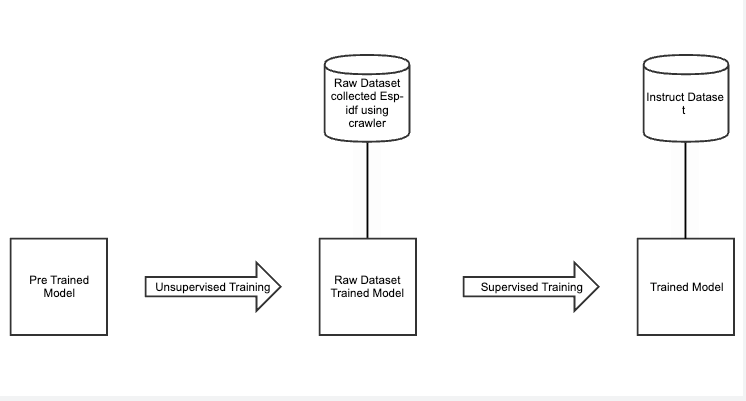
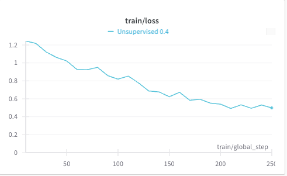
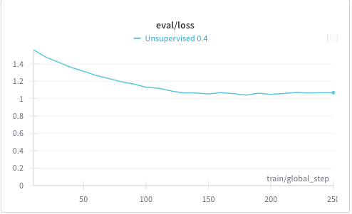
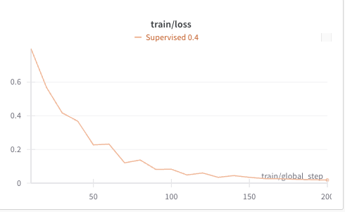

# Project Title

## Abstract

In this paper, I present an innovative approach utilizing large language models (LLMs) for adaptive course evaluation and instruction within the platforms. The core methodology involves fine-tuning a pre-trained LLM, specifically Mistral 7b-instruct 0.2, to evaluate user responses and provide tailored hints and suggestions. The model is trained in two stages: initially with unsupervised fine-tuning using raw datasets to recognize patterns, followed by supervised fine-tuning with curated question-answer datasets to enhance instructive capabilities.

Following training, the model's performance demonstrates promising results, although occasional hallucinations are observed, likely attributed to limited reference data. Additionally, future phases aim to incorporate Direct Preference Optimization (DPO) using human feedback to further enhance the model's evaluative capabilities.

## Introduction

Port 11 is an AI-powered Learning Management System (LMS) designed with the primary objective of preparing students for the professional job market with in-demand skills in Application Development, VLSI Design, Embedded System Design etc. Teachers, companies, or colleges can create courses and assignments that are evaluated by AI, eliminating the need for human evaluators. Additionally, each assignment is monitored by Proctoring AI, which tracks eye movement, audio, and spatial context, feeding this data into a database for evaluation

## Objective

Create a subject-expert AI model that can evaluate the user’s answer and give hints and suggestions. The model should be able to evaluate individual users based on their overall course performance. Additionally, the model should, on a macro level, understand the course structure and manage the course without the need for a human evaluator.

### Phase 1 Objective

Fine-tune the existing pre-trained LLM to evaluate user code logic, score it, and provide different levels of hints based on expertise in a single subject. ( In Phase 1, we are only considering a single subject expert on an embedded system of ESP MCU)

AI model should score the test in binary, checking if the answer is right or wrong, and the answer is sent to a human evaluator for human evaluation.

### Phase 2 Objective

Re-train the fine-tuned model using collected human-evaluated data through Direct Optimization Training. This approach will enable the model to provide a range-based scoring system for user answers, rather than a binary one.

Provide an API for ordinary users, such as course creators, to develop custom subject expert models that can be integrated into various courses based on user preferences. Additionally, implement a system that allows these custom models to enhance their performance through the integration of human evaluation data (Automated DPO training).

### Phase 3 Objective

Create an ensemble model with custom models created from Phase 2, to make a mixture of subject experts that can together evaluate any course without a need for the course creator’s intervention eliminating human evaluation.

Develop a course analyzer model that is incorporated into an ensemble model for comprehensive course performance analysis. Utilize user performance metrics to optimize the course dynamically, such as skipping stages for high performers and adjusting scoring mechanisms accordingly.

## Model Training (Phase 1)

All model training is conducted using Mistral 7b-instruct 0.2 from Mistral AI, chosen for its efficiency in utilizing fewer resources for both model training and inference. While the described training method is compatible with any Causal LLM like Lamma 3 8b or 70b, Mixtral 7x22b, Gemma, etc., for this project, the focus remains on Mistral 7b-instruct 0.2. The dataset comprises information extracted from ESP-IDF by Expressif, supplemented by a manually curated instruct dataset created by myself. The instruct model is favoured for its suitability in tasks involving evaluation and hint suggestion, as opposed to the next token generation.

This training is divided into 2 stages,

Unsupervised fine-tuning with unlabeled data: This stage enables the model to recognize patterns within the raw dataset.

Supervised fine-tuning with labelled datasets (question-answer dataset): This aims to re-enable the instruct capabilities of the model


### Unsupervised Fine-tuning

This step involves three main stages: dataset collection, dataset cleanup, and the creation of an evaluation dataset.

Dataset Collection: Data is gathered from https://docs.espressif.com using a web crawler.

Dataset Cleanup: The collected dataset undergoes cleanup procedures and is split into chunks.

Evaluation Dataset Creation: An evaluation dataset is randomly created from these chunks using a third-party external AI such as the ChatGPT API.

Finally, the collected dataset is trained with the base model using Low Rank Adaptation (LoRa) to mitigate resource-heavy training of the entire weight of this large model. In this process, all linear layers of the model are trained with LoRa.

#### Dataset Creation

I utilized the ‘trafilatura’ Python library for web crawling. The extracted data can be found at https://huggingface.co/datasets/gouthamsk/esp_idf_mined_data. This dataset initially contained raw data with varying context lengths, which isn't ideal for training as uniform context lengths yield better results. To achieve this uniformity, I broke down the raw dataset into chunks.

<br>
Before Clustering Adjacent Sentences
<br>
<br>
For this purpose, I employed another bidirectional encoder model (BERT). Specifically, I used the 'en_core_web_lg' model from Spacy, which implements Clustering Adjacent Sentences. This approach clusters adjacent sentences based on their semantic similarity, assuming that consecutive sentences in a text are more likely to be semantically related.

The resulting chunked dataset is available at https://huggingface.co/datasets/gouthamsk/esp_idf_chunked_data. Here, you'll find a more evenly spread-out context length.


<br>
After Clustering Adjacent Sentences
<br>
<br>
Next,To create the evaluation dataset for unsupervised training, an external AI API, such as a prompting AI, is employed. This API generates prompts based on the chunked text data.

#### Training

The model was loaded in 4-bit quantization and trained with LoRa adaptors targeting all the linear layers of the Mistral model. The training was conducted for 250 steps with a batch size of 6 on an A100 accelerator. Hugging Face's SFTTrainer was utilized for training. Below are the training arguments derived from extensive experimentation with these values

```python
LoraConfig(
    lora_alpha=32,
    lora_dropout=0.05,
    r=64,
    target_modules=[ "v_proj",
    "up_proj",
    "gate_proj",
    "k_proj",
    "q_proj",
    "down_proj",
    "o_proj"],
    bias="none",
    task_type="CAUSAL_LM"
)
TrainingArguments(
  output_dir = "mistral-embedded-c-v0.3",
  max_steps = 250,
  per_device_train_batch_size = 6,
  per_device_eval_batch_size = 6,
  gradient_accumulation_steps = 1,
  warmup_steps = 0.03,
  save_strategy="epoch",
  optim="adamw_8bit",
  save_steps=10,
  logging_steps=10,
  eval_steps=10,
  evaluation_strategy="steps",
  learning_rate=5e-5,
  bf16=True,
  lr_scheduler_type='cosine',
  report_to="wandb",
)
```

### Findings




## Supervised Fine-tuning

This process involves retraining the unsupervised model from the previous phase and subsequently training it with an instruct dataset. This instruct dataset consists of question-answer pairs, curated by myself and published on https://huggingface.co/datasets/gouthamsk/embedded_dataset_mixed_small.

```python
peft_config = LoraConfig(
    lora_alpha=32,
    lora_dropout=0.05,
    r=64,
    target_modules=[ "v_proj",
    "up_proj",
    "gate_proj",
    "k_proj",
    "q_proj",
    "down_proj",
    "o_proj"],
    bias="none",
    task_type="CAUSAL_LM"
)
args = TrainingArguments(
  output_dir = "mistral-embedded-c-instruct-v0.3.1",
  max_steps = 200,
  per_device_train_batch_size = 5,
  warmup_steps = 0.03,
  logging_steps=10,
  save_strategy="epoch",
  optim="adamw_8bit",
  learning_rate=2e-4,
  bf16=True,
  lr_scheduler_type='constant',
  report_to="wandb",
)
```


<br>
The graph illustrates a gradual decline in training loss, indicating that the training dataset fits well with the model. The Model is hosted in gouthamsk/mistral-embedded-c-instruct-v0.4.gguf · Hugging Face .

### Result

Given below are examples prompt using the base model and the fine-tuned model
<br>
<br>
PROMPT :
<br>
`write a program to blink a led for ESP32`
<br>
<br>
Base Model Response :
<br>

```cpp
#define LED_BUILTIN 2 // Change this to the GPIO pin number of your LED, e.g., 2 or 13
void setup() {
  // Set the LED pin as an output
  pinMode(LED_BUILTIN, OUTPUT);
}
void loop() {
  // Turn on the LED
  digitalWrite(LED_BUILTIN, HIGH);
  delay(500); // Wait for half a second
  // Turn off the LED
  digitalWrite(LED_BUILTIN, LOW);
  delay(500); // Wait for another half second
}

Replace `LED_BUILTIN 2` with the appropriate GPIO pin number for your ESP32 board and LED. For example, if your LED is
connected to GPIO pin 13, change `#define LED_BUILTIN 2` to `#define LED_BUILTIN 13`.
After writing this code, compile it using the Arduino IDE and upload it to your ESP32 board. Once uploaded, the LED
should start blinking with a half-second on-time and half-second off-time.
```

<br>
<br>
Fine-tuned Model Response :

```cpp
#include <stdio.h>
#include <string.h>
#include "freertos/FreeRTOS.h"
#include "freertos/Task.h"
#include "driver/gpio.h"
// Define the GPIO pin to which the LED is connected
#define LED_PIN GPIO_NUM_2 // Change this to the appropriate pin number
void app_main() {
    // Configure the GPIO pin as output
    esp_err_t err = gpio_config(LED_PIN, &gpio_config_t{
        .pin_bit_mask = (1ULL << LED_PIN),
        .mode = GPIO_MODE_OUTPUT,
        .pull_down_en = 0,
        .pull_up_en = 0,
        .intr_type = GPIO_INTR_DISABLE,
    });
    if (err != ESP_OK) {
        printf("Error configuring GPIO: %s\n", err_to_name(err));
        return;
    }
    while (1) {
        // Turn the LED on
        gpio_set_level(LED_PIN, 1);
        vTaskDelay(1000 / portTICK_PERIOD_MS);
        // Turn the LED off
        gpio_set_level(LED_PIN, 0);
        vTaskDelay(1000 / portTICK_PERIOD_MS);
    }
}

```

The response above indicates that the fine-tuned model utilizes ESP-IDF to generate a response, rather than relying on Arduino for response generation

<br>
<br>
PROMPT :
<br>
`give me a hint to blink a led in GPIO 2 with ESP32`
<br>
<br>
Base Model Response :
<br>

```
To make an ESP32 blink an LED connected to GPIO 2 using Arduino IDE or MicroPython, follow these steps:
1. Set up your development environment and connect the LED to the ESP32 as follows:
   - Connect one end of the LED to ground (GND).
   - Connect the other end of the LED to GPIO 2. You may also need a 220 Ohms resistor between the LED's anode and the GPIO.
2. Write your Arduino or MicroPython code:
Arduino:

#define LED_PIN 2
void setup() {
  pinMode(LED_PIN, OUTPUT);
}
void loop() {
  digitalWrite(LED_PIN, HIGH);   // turn the LED on (HIGH is the voltage level)
  delay(1000);                       // wait for a second
  digitalWrite(LED_PIN, LOW);    // turn the LED off by making the voltage LOW
  delay(1000);                       // wait for a second
}

MicroPython:
import machine
import time
led = machine.Pin(2, machine.Pin.OUT) # create an output pin on D2
def main():
    while True:
        led.on()          # turn the LED on
        time.sleep(1)     # wait for 1 second
        led.off()         # turn the LED off
        time.sleep(1)     # wait for 1 second
if __name__ == '__main__':
    main()

3. Upload your code to the ESP32:
   - In Arduino IDE, press the "Upload" button or choose Sketch > Upload from the menu.
   - For MicroPython, use the `mppost` tool to upload your code (https://docs.micropython.org/en/latest/microbit/tutorials/mppost/index.html)
     or use the Thonny REPL to send it directly to your ESP32 (https://docs.micropython.org/en/latest/faq/connecting.html#using-the-thonny-repl).
4. Verify if the LED is blinking as expected.

```

<br>
<br>
Fine-tuned Model Response :

`Set the GPIO number to 2 and make sure it is in output mode before toggling the pin state to turn the LED on and off.`
The response above suggests that the fine-tuned model understands the specific task context, which is to provide a single helpful hint. In contrast, the base model tends to provide excessive elaboration on the hint

## Conclusion

The approach outlined in this paper is expected to be applicable to larger LLM models with parameters greater than 7b. Furthermore, upon further training with Direct Preference Optimization (DPO) using human feedback, the fine-tuned model should exhibit behaviour akin to a human evaluator. This proposed phase, however, is contingent upon data collection.

The primary challenge encountered was conducting unsupervised training for the model to discern patterns regarding new subjects and creating an evaluation dataset for the curated dataset. To address this, a third-party AI was utilized to generate the evaluation dataset. Additionally, creating an instruction dataset necessitated manual curation by human evaluators, which proved to be time-consuming.

Despite these challenges, the model ultimately yielded the expected results. However, there were instances where the model exhibited hallucinations, possibly due to insufficient reference data. This issue could be mitigated by incorporating a vector database (or embedding) alongside the model to access correct data. While the model can evaluate user answers and determine correctness through prompts, false positive results may occur, potentially due to the use of a smaller model. This issue might be mitigated by transitioning to fine-tuning with a larger model containing more linear layers.

## Resources Used

1X A100 GPU for training

1X T4 GPU for inference

Jupiter notebook for development

## Reference Link

[https://ollama.com/goutham/mistral-embedded-c-instruct-v0.4](https://ollama.com/goutham/mistral-embedded-c-instruct-v0.4)

[https://huggingface.co/gouthamsk/mistral-embedded-c-v0.4](https://huggingface.co/gouthamsk/mistral-embedded-c-v0.4)

[https://huggingface.co/gouthamsk/mistral-embedded-c-v0.4](https://huggingface.co/gouthamsk/mistral-embedded-c-v0.4)

[https://ollama.com/goutham/mistral_embedded_c_instruct](https://ollama.com/goutham/mistral_embedded_c_instruct)

[https://huggingface.co/datasets/gouthamsk/esp_idf_mined_data](https://huggingface.co/datasets/gouthamsk/esp_idf_mined_data)

[https://huggingface.co/datasets/gouthamsk/esp_idf_chunked_data](https://huggingface.co/datasets/gouthamsk/esp_idf_chunked_data)

[https://huggingface.co/datasets/gouthamsk/embedded_dataset_mixed_small](https://huggingface.co/datasets/gouthamsk/embedded_dataset_mixed_small)

[Author - Goutham S Krishna ](https://www.linkedin.com/in/goutham-s-krishna-21ab151a0/)
